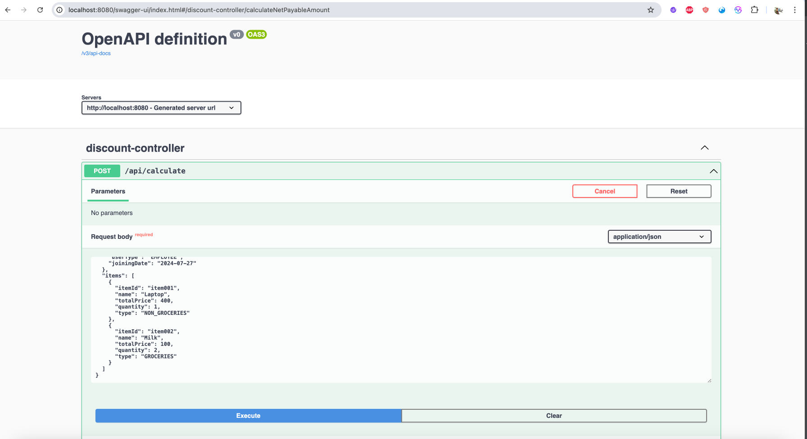
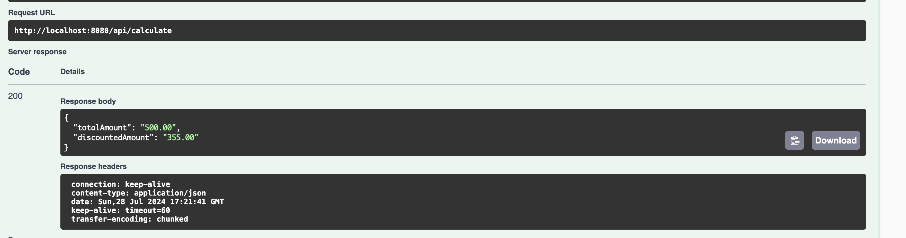
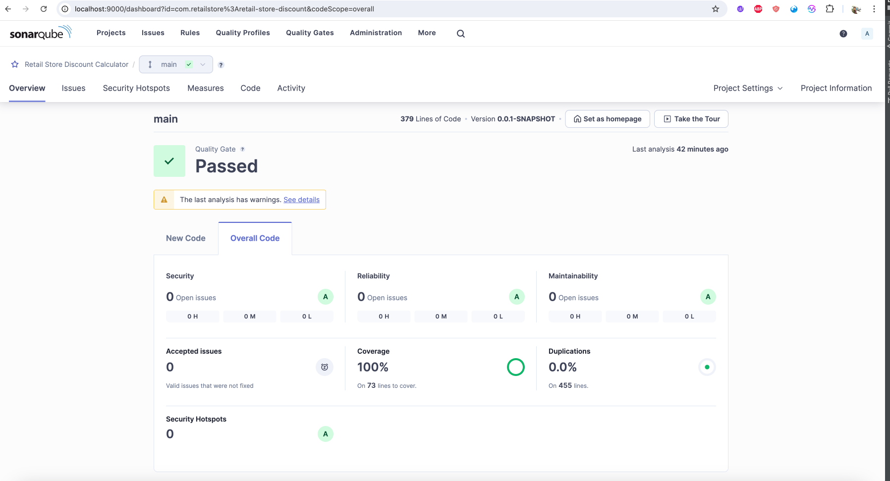
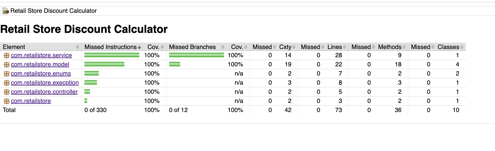

# Retail Store Discount Application

## Overview

This project is a backend service for calculating discounts on a retail store website. The application considers various discount criteria and computes the net payable amount for a given bill. The application is built using Java Spring Boot and follows an object-oriented programming approach with extensive unit test coverage.

## Discount Rules

The following discounts apply on the retail website:

### Percentage Based Discount
| Discount Type           | Discount Rate | Condition                                       |
|-------------------------|---------------|-------------------------------------------------|
| **Employee Discount**   | 30%           | Employees                                       |
| **Affiliate Discount**  | 10%           | Affiliates                                      |
| **Loyalty Discount**    | 5%            | Customers with over 2 years of loyalty          |
| **Non-Grocery Rule**    | N/A           | Percentage-based discounts do not apply to groceries |
| **Single Percentage Discount** | N/A    | Only one percentage-based discount applies per bill |

### General Discount
| Discount Type           | Discount Amount | Condition                        |
|-------------------------|-----------------|----------------------------------|
| **Bill Amount Discount**| $5 for every $100 | Applied on the total bill amount |

## Implementation Status

| Feature                                      | Status |
|----------------------------------------------|--------|
| Code Implementations                         | Done   |
| Unit tests with 100% coverage with JaCoCo    | Done   |
| Static code analysis (CheckStyle and SpotBugs) | Done   |
| SonarQube report for code quality            | Done   |
| Bash script for end-to-end process           | Done   |
| Integration with Swagger                     | Done   |

## Project Structure

The project is structured as follows:
- `src/main/java`: Contains the main application code.
- `src/test/java`: Contains the unit tests.
- `pom.xml`: Maven configuration file.
- `sonar-project.properties`: SonarQube configuration.
- `build_and_test.sh`: Executable script file.

## High-Level UML Class Diagram

The following diagram represents the high-level structure of the classes used in the discount calculation system.

### Constants 
[](https://mermaid.live/edit#pako:eNp9kFFrgzAQx79KOOjTRBKnVvMm1YLg1rK6hw6hZJq2giZFE1gnfvdluvVlo_d0d__fHXf_AUpZcaBQiLJhfR_X7NSxthDIxGKB4rovpRZqJUWvmFD9rEzsXxENs_wdD6iS-r3hKHnaZpt9khzidLfavD7n_zDRep1maZTfhcyWKMv395Bt8nIgGN8QNDNjIcCClnctqyvz7HRmAerMW14ANWnFj0w3qjA-jAZlWsndVZRAVae5BZ3UpzPQI2t6U-lLxRT_serWvTDxJmX7O2JKoAN8AHWIZ_ueG7jYcfCjGxILrkCJh21C_OUSkyAMXD8cLfic5rHtjV9ppHrS)

### Controller and service class
[](https://mermaid.live/edit#pako:eNqlVW1v2jAQ_iunSJWoBlXKoNAIIa102iptXVW6LxNfjHOAV79ktjOVdvz3XRICKaQd2xIpJNw9zz2-O5-fAm5iDKJgorlkzl0KNrdMTXR2A11HR3ApHDep9iOjvTVSoi1MOaDGCk-FPbvebOxjtD8FR4iff1ddb9ElRjt8r73wy0GJHAJnkqeSebxGf8OWbCrxncpMjamQMoILeh5DBB-ZjiU6uPkyvgOLP1J03oE3WwLwi60EIHfQ6CEpOIHlpDBlDmMwOnfOIhQiVzU5KVfVYI7YQGiPdsY4HtelqHSu5Gcw2ECGw7q0Hbz2EvBHrVcqka-oy8z1FfxHKQXJhZhfIheKyS3NnfFMrhmER-Ui-CScH1zR-zAjGpWeLi-Fz_zLIpkZMCkhx1Hed2r1ctAbtBy1Z3MsZTZShzaCr_RswiE6kg3FtpU2PZORgV8mWHSX0a25NRztsqA-KCfXRn8oQP-Rnb8OfZHK-01O_LY2UcW7Ju6UYDV52JX0QvQYqf2V0PiZPbxamryxSucismIPQqWqth4sSaTg-a5-oTTfjdBCzyGmlVTFTY2RmO1l98no-R0FHKXOG4V2R81ogfyeem-Wi8nJBU0BkARrZUKBr4HQUMZms4do27BEZt3xzj7d2at1G_T5rhx7m6mv1KnGWqYD432X-lIXwOYesrTkC6ch7W3KvbHZcKU0esGkeMT9IUTP9QorA-kWqXsEkSxEsu7KmlOk1RruTc4oS_MOpLQNfrVatcMsAkE_qKhF6qG5VzUcQSz61OrD1FXdJzpoBlRyxURMx2pesklADaJwEkT0GuOMpdJP6MRdkStLvRkvNQ8iyig2A2vS-SKIZkw6-kqTrDvXh_Lm34Tpb8aoEkKfQfQUPATRaSc8Cdvh-Vm312l3Ou1-vxks6e9ueNI9Ow17nfNer0_3qhk85gThSa8TdjvtXnjebxPm7enqN0gavEo)
### Model Class
[](https://mermaid.live/edit#pako:eNp9VGtr2zAU_StCUEiZMXESO40ohS5xhyFNSh4fNgJFc9RUw5YyW4alIf-9evghe6E2CN17pXN0z73SGcZ8TyCCOxYnOM9nFB8ynO6Y-oH8bm7Ad5okxtBLtA3OxqO-b2AtMsoO4LcMRHs7sM1JBgo52M45zcV9JEj6AKgcczumsHsGB5WwjgZAGssxO5CFcQsQmHKWi6yIBc-A4IAyKihO6Aexzn6xMlIb7YyUfTUjxdbOqAwwnBLbTZkAfwvMBBUn26-QN6cjAUIO7UQPMxLTFCfyxAInLxmNSXdnz_A3SijaxqoIkaJ3NAWqGR0LF1l0X-vVKGPrta0raPTSZb2ml6rUVb1UYNHRTKFobYpy0moSHuNkhgUBf7g8HzuoeXd3z_C1O2XR0qjCRjWdYyOihuhrYRoJbGFCVlT923SSzqmlzo_VchquonBtOxfLxWsnUEM3Mv8PFj6_zJc_w9D2PT49RfPocdNyTrfrzfI5XFnYZqovsOs-mDoipVHeiegbYSKg5yktUsxOt2aVDlar9AGR1d8atEIvo02FoQNTkqWY7uWjo_PaQfFOZGdAJKd78oaLROzke3SRS3Eh-PrEYohkVYgDM14c3iF6w0kureK4l3Urn6zae8TsF-dptUWaEJ3hP4g8b-J6A28SBN5o7AcTb-zAk3SP-u7AHwfeIOj373x_dHHghwbou8HIG3qBfzcc-v1AGpdPRJCRXQ)


## Prerequisites

- Java 11 or higher
- Maven 3.6.3 or higher
- Docker (optional - needed only for SonarQube Server configuration)

## Getting Started

### Clone the Repository

```sh
git clone https://github.com/yourusername/retail-store-discount.git
```

```sh
cd retail-store-discount
```

### Give the build_and_test.sh Executable Permissions

```sh
sudo chmod +x build_and_test.sh
```
### Run the Build and Test Script

```sh
./build_and_test.sh
```

This script will:
    
* Build the project.
* Perform static code analysis and spot bugs. 
* Run tests and publish the results to JaCoCo. 
* Starts the application.

### Check Application Health for Successful Startup

```sh
http://localhost:8080/actuator/health
```

Once the status shows as up, proceed to the next step.

### Accessing the REST Application

The application is integrated with Swagger, making the REST API endpoints and schema available at:


```sh
http://localhost:8080/swagger-ui/index.html
```

Use the sample payload below

```sh
{
  "billId": "bill001",
  "user": {
    "userId": "USER1",
    "userName": "TestUser",
    "userType": "EMPLOYEE",
    "joiningDate": "2024-07-27"
  },
  "items": [
    {
      "itemId": "item001",
      "name": "Laptop",
      "totalPrice": 400,
      "quantity": 1,
      "type": "NON_GROCERIES"
    },
    {
      "itemId": "item002",
      "name": "Milk",
      "totalPrice": 100,
      "quantity": 2,
      "type": "GROCERIES"
    }
  ]
}

```

Sample Output

```sh
{
  "totalAmount": "500.00",
  "discountedAmount": "355.00"
}
```

- Details About the Computations
    - item001 - totalPrice: 400 - NON_GROCERY
    - item002 - totalPrice: 100 - GROCERY
    - User - EMPLOYEE - Joining date (2024-07-27)
    - Step by Step Calculation:
        -   Total Price(totalAmount): 400 + 100 = 500
        -   Total Price Non-Grocery Items: 400
        -   Employee Discount: 30% on non-grocery items = 400 * 0.30 = 120
        -   Loyalty Discount: 0 (Since customer has not joined before 2 years)
        -   Default Discount: $5 for each $100 purchase on bill amount = (500 / 100) * 5 = 25
        -   Net Payable Amount(discountedAmount): Total Price - Employee Discount - Default Discount = 500 - 120 - 25 = 355

### JaCoCo Test Report for Unit Tests Locally
Once the build_and_test.sh script is executed and the application is started:

```sh
-   Go to target/site/jacoco/
-   Open index.html in a web browser to view the unit test code report.
````

## Running SonarQube locally with Docker

Run SonarQube Container

```sh
docker run -d --name sonarqube -p 9000:9000 sonarqube:latest
```

### Access SonarQube
-   Access SonarQube at http://localhost:9000
-   Log in with default credentials (username: admin, password: admin)
-   Change the password upon first login
-   Go to Profile -> My Account -> Security -> Generate a Token
-   Use the generated token in the following command:

```sh
mvn clean verify sonar:sonar -Dsonar.token=<token>
```

### To Include SonarQube Deployment in build_and_test.sh (optional)

In the build_and_test.sh After code coverage uncomment the following snippet, with the generated token value.

```sh
echo "Starting SonarQube analysis..."
execute_step mvn clean verify sonar:sonar -Dsonar.token=<token>
echo "SonarQube analysis successful."
```
### Screen Shots for reference:

* Swagger UI Request:



* Swagger UI Response:



* SonarQube



* CodeCoverage

